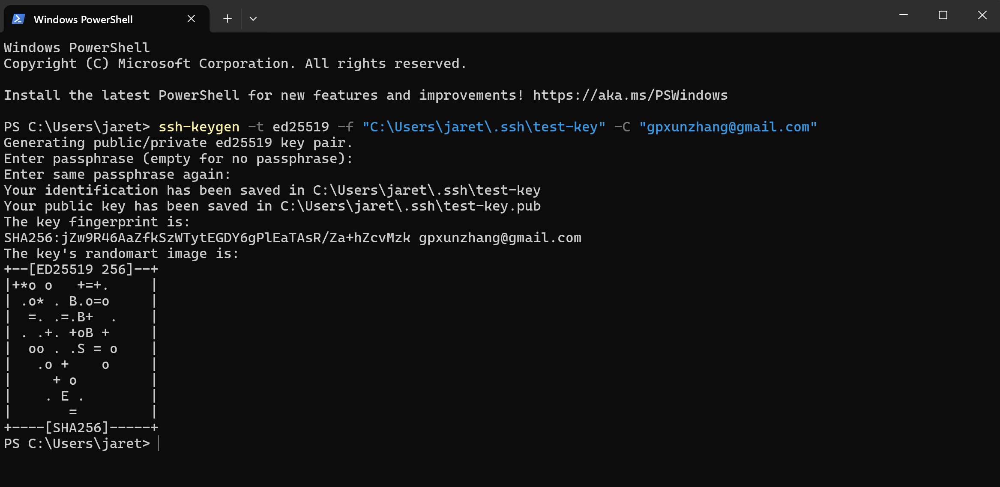
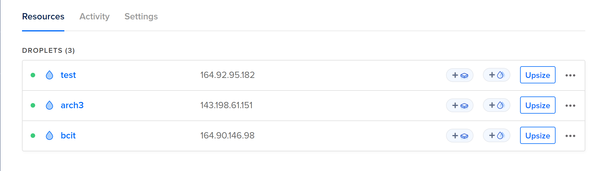
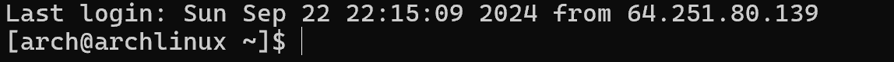
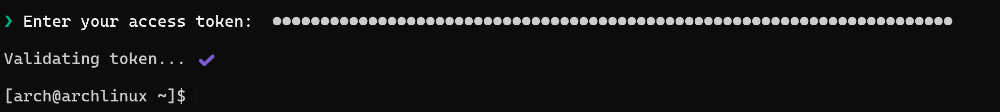
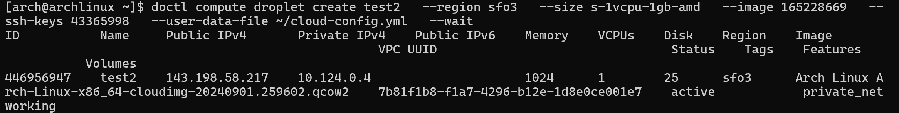
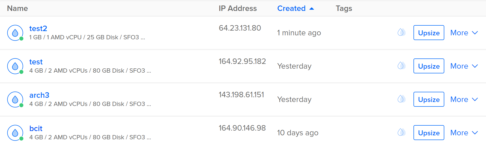
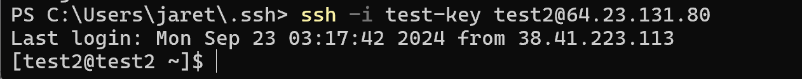
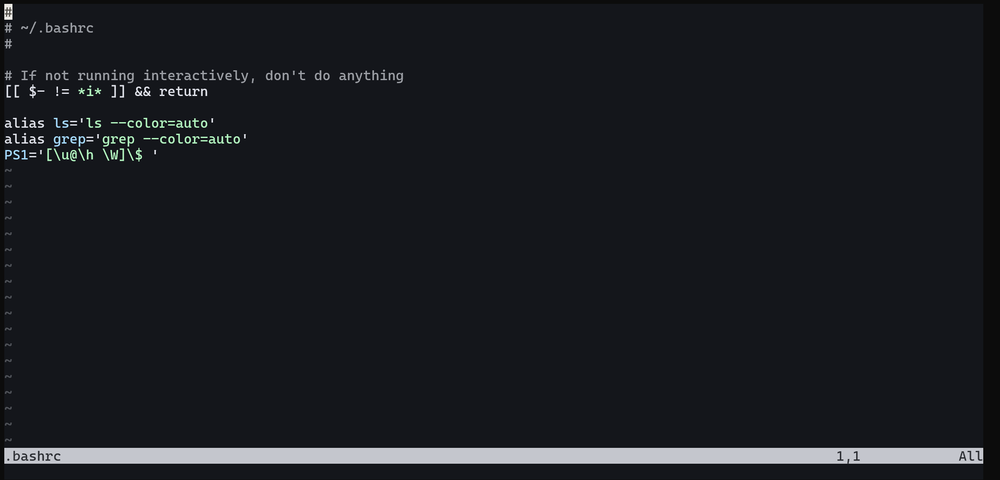

# ACIT 2420 Assignment 1

## Tutorial: Creating a Remote Server on DigitalOcean using `SSH` and `doctl`


### Learning outcomes and topics
- In this tutorial, we will learn how to create a remote server using DigitalOcean.
- We will learn how to connect to the remote server using `SSH`.
- We will explore `Cloud-Init` and how to use it to automate the configuration of the remote server.
- We will achieve the task in a more technical way by using the command line (`doctl`). 

### Key Steps
- Create `SSH` keys on your local machine.
- Create a Droplet running Arch Linux using the `doctl` command-line tool.
- Use doctl and `Cloud-Init` for every stage of setting up an Arch Linux Droplet.

### Creating SSH Keys on Your Local Machine
#### What is SSH? Why do we need it?
SSH stands for Secure Shell. It is a cryptographic network protocol that allows secure communication between two computers. It is widely used by network administrators for managing systems and applications remotely. SSH provides a secure way to access a remote server, transfer files, and execute commands on a remote machine. (DigitalOcean, n.d.)

#### How to create SSH keys?
1. Open the terminal on your local machine.
2. Run the following command to generate a new SSH key pair:
   On windows, you might want to create a ssh folder in your user directory. Then run the command below to generate the key pair. Remember to replace your email address with your actual email address.
  ```bash 
   ssh-keygen -t ed25519 -f ~/.ssh/do-key -C "your email address"
  ```
  If you are a Windows PowerShell user, you might want to replace the tilde(~) with the full path to your user directory because the tilde is not recognized in PowerShell.

  ```bash 
   ssh-keygen -t ed25519 -f C:\Users\your-user-name\.ssh\do-key -C "youremail@email.com"
  ```
  - `-t = type` (this is the type of encryption used for the key)
  - `-f = filename` (specify filename and location)
  - `-C = comment` (attaches a comment to a key)

3. You will be prompted to enter a passphrase. You can either enter a passphrase or leave it blank. If you leave it blank, the key will be created without a passphrase.


4. The SSH key pair will be generated and saved in the 'ssh' folder. The public key will have a .pub extension.



### Creating a droplet on DigitalOcean
Please ensure you already have a DigitalOcean account. If you don't have one, you can create one on the [DigitalOcean website](https://www.digitalocean.com/).

#### Uploading the Arch Linux Image to DigitalOcean
1. First, we need to download the `Arch Linux` as the image for our droplet. Find the `qcow2` image of Arch Linux from the [Arch Linux website](https://gitlab.archlinux.org/archlinux/arch-boxes/-/packages/1545).


2. Log in to your DigitalOcean account.
3. Look for the `settings` icon on the left side of the screen and click on it. 
4. Look for the `Backups & Snapshots` menu on the left side and click on it. Select `Custom Images` then click the blue `Upload Image` button on the right side of the screen. Choose the Arch Linux image you downloaded earlier and click `Upload Image` when you see the prompt.

#### Adding the SSH Key to DigitalOcean
1. Click on the `settings` icon on the left side of the screen.
2. Look for the `Security` menu on the left side and click on it. Select `SSH Keys` then click the blue `Add SSH Key` button on the right side of the screen.
3. Copy the contents of the public key file you generated earlier and paste it into the `SSH Key Content` field. Give the key a name(For example: "test-key") and click `Add SSH Key`.

You can use the following command to copy the contents of the public key file:

In Powershell:
```bash
Get-Content C:\Users\your-user-name\.ssh\test-key.pub | Set-Clipboard
```
On MacOS:
```bash
pbcopy < ~/.ssh/test-key.pub
```
On Linux:
```bash
wl-copy < ~/.ssh/test-key.pub
```

#### Create a new Arch Linux droplet and connect to it using SSH
1. Find the `Create` button on the top right corner of the screen and click on it. Select `Droplets` from the dropdown menu.
2. Then you will see a list of options to create a new droplet. Below is the important information you need to fill in:
   - Choose Region = `San Francisco`
   - Datacenter = `SF03`
   - Choose an image: Select the Arch Linux image you uploaded earlier.
   - Choose a size: Leave it as default.
   - Choose CPU options: Leave it as default.
   - Authentication: Select the SSH key you added earlier.
   - Choose additional options: You can leave this as default.
   - Finalize and create: Give your droplet a name(For example: I used 'test') and click the `Create Droplet` button. 
3. Once the droplet is created, you will see the IP address of the droplet. Copy the IP address.



4. Run the following command to connect to the droplet using SSH. Replace the IP address with the actual IP address of your droplet you just copied.
```bash
ssh -i .ssh/test-key arch@your-droplets-ip-address
```
- `arch` is the default username for the Arch Linux image.

5. You will be prompted to enter the passphrase you created earlier. If you left it blank, you will be connected to the droplet without entering a passphrase. Once you are connected, you will see the following image:



Now you already have a droplet on DigitalOcean and you have connected to it using SSH. Next, we will learn how to create a new droplet using the command line(`doctl`), and how to use `cloud-init` to automate the configuration of the droplet.

### Installing and Configuring doctl
#### What is doctl?
`doctl` is a command-line interface for the DigitalOcean API. It allows you to manage your DigitalOcean resources from the command line. You can use `doctl` to create, delete, and manage Droplets, volumes, and other resources on DigitalOcean. (DigitalOcean, n.d.)

#### How to install `doctl` on existing droplet?

1. First, we should generate a `API token` from the DigitalOcean website. Navigate to the `API section` from the left-hand menu. Under `Personal Access Tokens`, click `Generate New Token`. Give the token a name(for example: "test-token") and ensure `Full Access` is selected. Click `Generate Token`. A token string will appear. Copy it immediately because we will use it later.

2. As we have already connected to the `test` droplet using SSH, we can install `doctl` on the droplet. Run the following command:
```bash
sudo pacman -S doctl
```
3. Configure `doctl` by authenticating it with your DigitalOcean API token. Run the following command:

```bash
doctl auth init
```
You will be prompted to enter the API token you generated earlier. Paste the token and press Enter. You will see the following image if the authentication is successful:



### Prepare your cloud-init configuration file
#### What is cloud-init?
Cloud-init is a multi-distribution package that handles early initialization of a cloud instance. It is used to configure the instance during the first boot. Cloud-init is widely used in cloud environments to automate the configuration of virtual machines. (Cloud-Init, n.d.)

#### What is the benefit of using cloud-init?
Cloud-init allows you to automate the configuration of your virtual machines. You can use cloud-init to install packages, create users, set up SSH keys, and perform other tasks during the first boot of the instance. This helps you to create consistent and reproducible environments in the cloud. (Cloud-Init, n.d.)

#### How to create a cloud-init configuration file?

- **Tips**: Because we will be using current droplet to create a new droplet, we need to stay connected to the droplet(`test`). In this server, we will create a new file and write the cloud-init configuration in it. Then we will use this file to create a new droplet using the command line(`doctl`).

1. Create a new file on current droplet. Run the following command:
```bash
nvim cloud-config.yml
```
This will create a new file named `cloud-config.yml` and open it in the `nvim` editor.

2. Press `i` to enter insert mode. Then add the following content to the file:
```yaml
#cloud-config
users:
  - name: user-name #change me(for example: I used 'test2')
    primary_group: user-group # change me(you can use the same name as the user name)
    groups: wheel
    shell: /bin/bash
    sudo: ['ALL=(ALL) NOPASSWD:ALL']
    ssh-authorized-keys:
      - ssh-ed25519 your-ssh-public-key # change this(This will be the public key you generated earlier - test-key.pub)

packages:
  - ripgrep
  - rsync
  - neovim
  - fd
  - less
  - man-db
  - bash-completion
  - tmux

disable_root: true
```
3. Press `Esc` and type `:wq` to save and exit the file.

### Create a new droplet using the command line(`doctl`)
1. Now we should first retrieve the image ID of the Arch Linux image we uploaded earlier. Run the following command:
```bash
doctl compute image list-user
```
You will see a list of images. Find the Arch Linux image and copy the ID.

2. Then we should retrieve the SSH key ID. Run the following command:
```bash
doctl compute ssh-key list
```
You will see a list of SSH keys. Find the SSH key you added earlier and copy the ID.

**Tips**:
- DigitalOcean needs an SSH key for the root user login when the image doesn't allow root password authentication. This key will enable you to SSH into the droplet as root.
- `cloud-init` will then run and configure any additional users and their SSH keys as specified in the YAML file.
3. Now we are ready to create a new droplet using the following command line(`doctl`):
    
```bash
doctl compute droplet create test2 \ #change me(for example: I used 'test2')
  --region sfo3 \ #This means San Francisco 03
  --size s-1vcpu-1gb-amd \ #This means 1 vCPU and 1 GB memory
  --image 165228669 \ #This is the image ID of the Arch Linux image
  --ssh-keys 43365998 \ #This is the SSH key ID
  --user-data-file ~/cloud-config.yml \ #change me(if you saved the file in a different location)
  --wait
```
Once the droplet is created, you will see the following image:



Now you can nevigate to your DigitalOcean account and you will see the droplet you created using the command line(`doctl`). Below is the image of the droplet we just created:



### Connect to the new droplet using SSH
1. Copy the IP address of the droplet(`test2`) you created using the command line(`doctl`).
2. Run the following command to connect to the droplet using SSH. Replace ``your-droplets-ip-address`` with the IP address of your droplet.

```bash
ssh -i .ssh/test-key arch@your-droplets-ip-address #change me(for example: ssh -i .ssh/test-key test2@64.23.131.80)
``` 
3. You will be prompted to enter the passphrase you created earlier. If you left it blank, you will be connected to the droplet without entering a passphrase. Once you are connected, you will see the following image:




4. You can run the following command to check if the packages are installed successfully. For example, you can run the following command to check if `neovim` is installed:
```bash
nvim ~/.bashrc
```
You will see the following image if `neovim` is installed successfully:


### Conclusion
**Congratulations!** Once you have completed the above steps,  you have successfully created a new droplet using the command line(doctl) and connected to it using SSH. You have also automated the configuration of the droplet using `cloud-init`.


### References
1. DigitalOcean. (n.d.). doctl: The official DigitalOcean command-line interface. DigitalOcean. [DigitalOcean website](https://www.digitalocean.com/)

2. Cloud-Init. (n.d.). Cloud-init. Read the Docs.[Cloud-Init](https://cloudinit.readthedocs.io/en/latest/).


